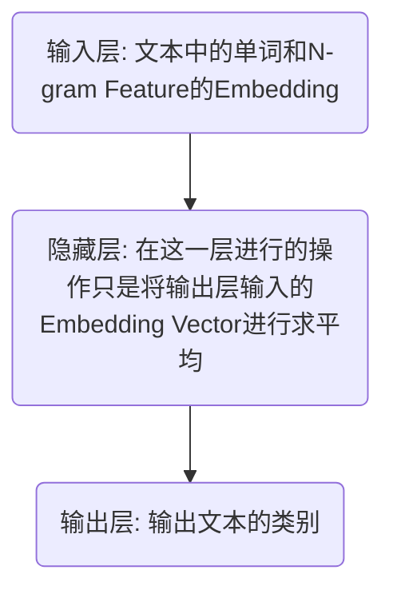

# README.md

## 推荐系统

### 阅读文献

*Smooth neighborhood recommender system*

*Scalable Collaborative Ranking for Personalized Prediction*

### 文献详述 -  Smooth neighborhood recommender system

#### 1. 简介：

**什么是推荐系统**

**主要方法与思路**

**当前研究的方向和问题**

#### 2. 正则化隐含因子模型

**模型定义**

**模型缺陷**

#### 改进模型：光滑邻域正则化隐含因子模型

**模型定义**

**对比之前模型的优势分析**

**模型求解**

**理论均方误差**

#### 3. 数值仿真与实例分析

**实例分析**

**数值仿真**

#### 4. 我的任务

### 文献详解 -  Scalable Collaborative Ranking for Personalized Prediction

## NLP-文本分类

### 文献阅读

*Natural language processing for ehr-based computational phenotyping*

*A survey of text classification algorithms. In Mining text data*

*Convolutional neural networks for sentence classification*

*Graph Convolutional Networks for Text Classification*

### 中文新闻分类

#### 经典分类器

##### 1. 预处理

提取标签以及分词：

```python
#writing for text anlysis using NB by liuyang 2020-06-07 to 2020-06-12

#先升级一下Anaconda下python的包
#pip install -i https://pypi.tuna.tsinghua.edu.cn/simple pip -U
#pip config set global.index-url https://pypi.tuna.tsinghua.edu.cn/simple
#pip install -U numpy
#pip install -U scikit-learn
#pip install -U sklearn

import pandas as pd
import pkuseg  #cut chinese words (or import jieba)


#set the stopwords

stopwords = pd.read_csv('cn_stopwords.txt', encoding='utf8', names=['stopword'], index_col=False)
stop_list = stopwords['stopword'].tolist()

#load date

cnews_test = pd.read_csv('cnews.test.txt', encoding='utf8', names=['lab','cnews_test'], index_col=False,sep='\t')
cnews_train = pd.read_csv('cnews.train.txt', encoding='utf8', names=['lab','cnews_train'], index_col=False,sep='\t')

cnews_train.head() #look look hh #之后都在这里看


# set the prio model(msra,ctb8,weibo) of cutting words (download in pkuseg ,github)

seg = pkuseg.pkuseg(model_name = "news") 
#file_path = '\Users\hey\Anaconda3\Lib\site-packages\pkuseg\msra'  #windows
#seg = pkuseg.pkuseg(model_name=file_path)

# cut words

cnews_train['cut'] = cnews_train['cnews_train'].apply(lambda x: [i for i in seg.cut(x) if i not in stop_list])
cnews_test['cut'] = cnews_test['cnews_test'].apply(lambda x: [i for i in seg.cut(x) if i not in stop_list])

#cnews_train.head()
```

##### 2. 清洗数据

过滤低频率词以及均匀分布的词

```python
# statistic words
words = []
 
for content in cnews_train['cut']:
    words.extend(content)

from collections import Counter
from pprint import pprint

counter_all = Counter(words)

import numpy as np

cnt_all = np.array(list(counter_all.values()))
words_all = list(counter_all)


# print the 1th to 15th words acrossing counting numbers
pprint(counter_all.most_common(15))


#computer the num or prob of words in different class

def cnt_class (label,cnews_train = cnews_train,counter_all = counter_all):
    cut_class = []

    for i in range(len(cnews_train['lab'])):
        if cnews_train['lab'][i]==label:
            cut_class.extend(cnews_train['cut'][i])

    counter = Counter(cut_class)

    cnt_class = Counter(words)
    for k in counter_all:
        if counter.get(k):
            cnt_class[k]=counter[k]
        else:
            cnt_class[k]=0
        
    cnt_class = np.array(list(cnt_class.values()))
    return cnt_class

#get the name of all lab

lab_cnt = Counter(cnews_train['lab'])
lab_all = list(lab_cnt)
print(lab_all)

#computer the peob

cnt_class_all_p = []

for lab in lab_all:
    cnt_class_all_p.append(cnt_class(label= lab )/cnt_all)
cnt_class_all_p = np.array(cnt_class_all_p)


#computer the var of the distribution of words in different class

def sigm (x):
    s = x-x.sum()/10
    s = sum(s*s)/10
    return s

cnt_class_all_p = pd.DataFrame(cnt_class_all_p)
sig = cnt_class_all_p.apply(lambda x: sigm(x),axis = 0)


#filtering the words we care.

#def which in words is useless

a = np.array(list(sig<0.025))
b = cnt_all<(len(cnews_train['lab'])*0.025)
det = a | b
print(len(det)-sum(det))  #print the number of words we need

#def the dic of words we need

def get_words_f (det,words_all = words_all):
    words_f = []
    for i in range(len(det)):
        if ~det[i]:
            words_f.append(words_all[i])
    return words_f

words_f = get_words_f(det)


words_f[1:15] #view the res #筛选结果还行
```

##### 3. 量化文本信息

监督值

```python
#get the y_train and the t_test as the information of class whichi will be inputting
#they are 1 dim vector which are int type with the number 1 to 9 

lab_num = np.linspace(0, 9, 10, endpoint=True,dtype = 'int')
lab_and_num_dic=dict(zip(lab_all, lab_num))

cnews_train['LabNum'] = cnews_train['lab']
cnews_test['LabNum'] = cnews_test['lab']

def lab_num (x,lab_and_num_dic = lab_and_num_dic):
    x = lab_and_num_dic[x]
    return x

cnews_train['LabNum'] = cnews_train['lab'].apply(lambda x: lab_num(x))
cnews_test['LabNum'] = cnews_test['lab'].apply(lambda x: lab_num(x))

y_train = np.array(cnews_train['LabNum'])
y_test = np.array(cnews_test['LabNum'])
```

词集模型

```python
#using Set Of Words Model for
#getting the X_train and the X_test as the information of the text whichi will be inputting.
#they are len(data) \times len(words dic) dim sparse array(by row) which are int type with the number 0-1.

def get_dic(words_f = words_f):
    A = np.ones(len(words_f),dtype='int')
    words_f_dic = dict(zip(words_f,A))
    return words_f_dic

words_f_dic = get_dic()
#words_f_dic_h = get_dic(words_f = words_f_h)
#words_f_dic_l = get_dic(words_f = words_f_l)

def findwords (x,words_f_dic=words_f_dic):
    y = []
    for i in words_f_dic:
        if i in x:
            y.append(words_f_dic[i])
        else:
            y.append(0)
            
    return y

#transfrom to spares array(csr_matrix)

from scipy import sparse

def get_X (cnews_train = cnews_train , cnews_test = cnews_test , dic = words_f_dic):
    X_train = cnews_train['cut'].apply(lambda x: findwords(x,words_f_dic = dic))
    X_test = cnews_test['cut'].apply(lambda x: findwords(x,words_f_dic = dic))

    X_train = np.array(list(X_train))
    X_train = sparse.csr_matrix(X_train)
    X_test = np.array(list(X_test))
    X_test = sparse.csr_matrix(X_test)
    return X_train , X_test

X_train , X_test = get_X()
```

词袋模型+TF-IDF

```python
#using Set Of Words Model + term frequency–inverse document frequency（TF-IDF） for
#getting the X_train and the X_test as the information of the text whichi will be inputting.
#they are len(data) \times len(words dic) dim sparse array(by row) which are double type.

#for using fun TfidfVectorizer() and HashingVectorizer()
def str_c (x,words_f = words_f):
    y = []
    for i in x:
        if i in words_f:
            y.append(i)
        
    y = " ".join(str(i) for i in y)    
    return y
    
#cnews_train['cut_c'] = cnews_train['cut'].apply(lambda x: str_c(x,words_f = words_f))
#cnews_test['cut_c'] = cnews_test['cut'].apply(lambda x: str_c(x,words_f = words_f))
train_cut_c = cnews_train['cut'].apply(lambda x: str_c(x,words_f = words_f))
test_cut_c = cnews_test['cut'].apply(lambda x: str_c(x,words_f = words_f))


X_w = list(train_cut_c)
X_t = list(test_cut_c)


from sklearn.feature_extraction.text import TfidfVectorizer

#the dim of test set and train set must be same ,
#so we need this dic as the option vocabulary when use TfidfVectorizer()

L = len(words_f)
A = np.linspace(0,L-1 ,L, endpoint=True,dtype = 'int')
the_words_f_dic = dict(zip(words_f,A))

vectorizer_tf = TfidfVectorizer(sublinear_tf=True,token_pattern=r"(?u)\b\w+\b",vocabulary = the_words_f_dic)
X_train_tf = vectorizer_tf.fit_transform(X_w)
X_test_tf = vectorizer_tf.fit_transform(X_t)
```

Hashing + TF-IDF

```python
#using Hashing + TF for
#getting the X_train and the X_test as the information of the text whichi will be inputting.
#they are len(data) \times 2**18 or 2**19 or 2**20 dim sparse array(by row) which are double type.

from sklearn.feature_extraction.text import HashingVectorizer

vectorizer_hs = HashingVectorizer(alternate_sign=False ,n_features=2 ** 18,decode_error='ignore')
X_train_hs = vectorizer_hs.transform(X_w)
X_test_hs = vectorizer_hs.transform(X_t)
```

##### 4. 贝叶斯分类器实现

```python
#def the fun to get and output the res of , score , train time , test time , density and dimensionality

from sklearn import metrics
from sklearn.utils.extmath import density
from time import time

def benchmark(clf,X_train = X_train,y_train = y_train,X_test = X_test,y_test = y_test):
    print('_' * 80)
    print("Training: ")
    print(clf)
    t0 = time()
    clf.fit(X_train, y_train)
    train_time = time() - t0
    print("train time: %0.3fs" % train_time)

    t0 = time()
    pred = clf.predict(X_test)
    test_time = time() - t0
    print("test time:  %0.3fs" % test_time)

    score = metrics.accuracy_score(y_test, pred)
    print("accuracy:   %0.3f" % score)

    if hasattr(clf, 'coef_'):
        print("dimensionality: %d" % clf.coef_.shape[1])
        print("density: %f" % density(clf.coef_))

    print()
    clf_descr = str(clf).split('(')[0]
    return clf_descr, score, train_time, test_time
```

##### 5. 选择量化文本信息的方法

```python
#print BernoulliNB, ComplementNB and MultinomialNB res 
#by train set using Set Of Words Model

results = []

from sklearn.naive_bayes import BernoulliNB, ComplementNB, MultinomialNB

print('=' * 80)
print("Naive Bayes （词集模型：one-hot编码向量化文本）")
results.append(benchmark(MultinomialNB(alpha=.01)))
results.append(benchmark(BernoulliNB(alpha=.01)))
results.append(benchmark(ComplementNB(alpha=.1)))
```

```python
#print BernoulliNB, ComplementNB and MultinomialNB res 
#by train set using Set Of Words Model + term frequency–inverse document frequency（TF-IDF）

print('=' * 80)
print("Naive Bayes （词袋模型+IDF：TFIDF向量化文本）")
results.append(benchmark(MultinomialNB(alpha=.01),X_train = X_train_tf,X_test = X_test_tf))
results.append(benchmark(BernoulliNB(alpha=.01),X_train = X_train_tf,X_test = X_test_tf))
results.append(benchmark(ComplementNB(alpha=.1),X_train = X_train_tf,X_test = X_test_tf))
```

```python
#print BernoulliNB, ComplementNB and MultinomialNB res 
#by train set using Hashing + TF Model

print('=' * 80)
print("Naive Bayes （HashingTF模型文本向量化）")
results.append(benchmark(MultinomialNB(alpha=.01),X_train = X_train_hs,X_test = X_test_hs))
results.append(benchmark(BernoulliNB(alpha=.01),X_train = X_train_hs,X_test = X_test_hs))
results.append(benchmark(ComplementNB(alpha=.1),X_train = X_train_hs,X_test = X_test_hs))
```

##### 6. 选择清洗数据的强度

```python
#find the best strength for filtering the words we need.
def NB_out (det_n):
    t0 = time()
    train_time = time() - t0
    words_f_n = get_words_f(det_n)
    
    a = cnews_train['cut'].apply(lambda x: str_c(x,words_f = words_f_n))
    b = cnews_test['cut'].apply(lambda x: str_c(x,words_f = words_f_n))
    
    X_w_n = list(a)
    X_t_n = list(b)
    
    L = len(words_f_n)
    A_n = np.linspace(0,L-1 ,L, endpoint=True,dtype = 'int')
    the_words_f_dic = dict(zip(words_f_n,A_n))
    
    vectorizer = TfidfVectorizer(sublinear_tf=True,token_pattern=r"(?u)\b\w+\b",vocabulary = the_words_f_dic)
    X_train_n = vectorizer.fit_transform(X_w_n)
    X_test_n = vectorizer.fit_transform(X_t_n)

    y = benchmark(MultinomialNB(alpha=.01),X_train = X_train_n,X_test = X_test_n)
    t_1 = time() - t0
    
    print("total time:  %0.3fs" % t_1)
    return y,t_1
```

```python
results_1 = []

a = np.array(list(sig<0.035))
b = cnt_all<(len(cnews_train['lab'])*0.035)
det_h_1 = a | b

results_1.append(NB_out(det_h_1))

a = np.array(list(sig<0.03))
b = cnt_all<(len(cnews_train['lab'])*0.03)
det_h = a | b
results_1.append(NB_out(det_h))

results_1.append(NB_out(det))

a = np.array(list(sig<0.02))
b = cnt_all<(len(cnews_train['lab'])*0.02)
det_l = a | b
results_1.append(NB_out(det_l))

a = np.array(list(sig<0.015))
b = cnt_all<(len(cnews_train['lab'])*0.015)
det_l_1 = a | b
results_1.append(NB_out(det_l_1))
```

##### 7. 用不同的分类器输出结果

```python
#print res of different method

#by using the model we choised to get the information of the text
#Set Of Words Model + term frequency–inverse document frequency（TF-IDF）

#and using the best strength for filtering the words:
#np.array(list(sig<0.02)) or cnt_all<(len(cnews_train['lab'])*0.02)

#get the train set

words_f_l = get_words_f(det_l)
a = cnews_train['cut'].apply(lambda x: str_c(x,words_f = words_f_l))
b = cnews_test['cut'].apply(lambda x: str_c(x,words_f = words_f_l))

#cnews_train['cut_f'] = a
#cnews_test['cut_f'] = b
#cnews_train.to_csv(path_or_buf="cnews_train_A.csv",encoding='utf-8')
#cnews_test.to_csv(path_or_buf="cnews_test_A.csv",index=False,encoding='utf-8')
#cnews_train_r = pd.read_csv("cnews_train_A.csv")
#cnews_test_r = pd.read_csv("cnews_test_A.csv")


X_w_l = list(a)
X_t_l = list(b)
    
L_l = len(words_f_l)
A_l = np.linspace(0,L_l-1 ,L_l, endpoint=True,dtype = 'int')
words_f_l_dic = dict(zip(words_f_l,A_l))
    
vectorizer = TfidfVectorizer(sublinear_tf=True,token_pattern=r"(?u)\b\w+\b",vocabulary = words_f_l_dic)
X_train_l = vectorizer.fit_transform(X_w_l)
X_test_l = vectorizer.fit_transform(X_t_l)
```

```python
#最高准确率为0.949
results_2 = []

from sklearn.linear_model import RidgeClassifier
from sklearn.linear_model import Perceptron
from sklearn.linear_model import PassiveAggressiveClassifier
from sklearn.neighbors import KNeighborsClassifier
from sklearn.ensemble import RandomForestClassifier

for clf, name in (
        (RidgeClassifier(tol=1e-2, solver="sag"), "Ridge Classifier"),
        (Perceptron(max_iter=50), "Perceptron"),
        (PassiveAggressiveClassifier(max_iter=50),
         "Passive-Aggressive"),
        (KNeighborsClassifier(n_neighbors=10), "kNN"),
        (RandomForestClassifier(), "Random forest")):
    print('=' * 80)
    print(name)
    results_2.append(benchmark(clf,X_train = X_train_l,X_test = X_test_l))


from sklearn.svm import LinearSVC
from sklearn.linear_model import SGDClassifier
    
for penalty in ["l2", "l1"]:
    print('=' * 80)
    print("%s penalty" % penalty.upper())
    # Train Liblinear model
    results_2.append(benchmark(LinearSVC(penalty=penalty, dual=False,tol=1e-3),X_train = X_train_l,X_test = X_test_l))

    # Train SGD model
    results_2.append(benchmark(SGDClassifier(alpha=.0001, max_iter=50,penalty=penalty),X_train = X_train_l,X_test = X_test_l))

# Train SGD with Elastic Net penalty
print('=' * 80)
print("Elastic-Net penalty")
results_2.append(benchmark(SGDClassifier(alpha=.0001, max_iter=50,penalty="elasticnet"),X_train = X_train_l,X_test = X_test_l))


from sklearn.neighbors import NearestCentroid

# Train Nearest Centroid without threshold
print('=' * 80)
print("NearestCentroid (aka Rocchio classifier)")
results_2.append(benchmark(NearestCentroid(),X_train = X_train_l,X_test = X_test_l))


# Train sparse Naive Bayes classifiers
print('=' * 80)
print("Naive Bayes")
results_2.append(benchmark(MultinomialNB(alpha=.01),X_train = X_train_l,X_test = X_test_l))
results_2.append(benchmark(BernoulliNB(alpha=.01),X_train = X_train_l,X_test = X_test_l))
results_2.append(benchmark(ComplementNB(alpha=.1),X_train = X_train_l,X_test = X_test_l))

from sklearn.pipeline import Pipeline
from sklearn.feature_selection import SelectFromModel
#from sklearn.svm import LinearSVC

print('=' * 80)
print("LinearSVC with L1-based feature selection")
# The smaller C, the stronger the regularization.
# The more regularization, the more sparsity.
results_2.append(benchmark(Pipeline([
  ('feature_selection', SelectFromModel(LinearSVC(penalty="l1", dual=False,
                                                  tol=1e-3))),
  ('classification', LinearSVC(penalty="l2"))]),X_train = X_train_l,X_test = X_test_l))
```

```python
#add plt
#The bar plot indicates the accuracy, training time (normalized) and test time (normalized) of each classifier.
import matplotlib.pyplot as plt

indices = np.arange(len(results_2))

results_3 = [[x[i] for x in results_2] for i in range(4)]

clf_names, score, training_time, test_time = results_3
training_time = np.array(training_time) / np.max(training_time)
test_time = np.array(test_time) / np.max(test_time)

plt.figure(figsize=(12, 8))
plt.title("Score")
plt.barh(indices, score, .2, label="score", color='navy')
plt.barh(indices + .3, training_time, .2, label="training time",
         color='c')
plt.barh(indices + .6, test_time, .2, label="test time", color='darkorange')
plt.yticks(())
plt.legend(loc='best')
plt.subplots_adjust(left=.25)
plt.subplots_adjust(top=.95)
plt.subplots_adjust(bottom=.05)

for i, c in zip(indices, clf_names):
    plt.text(-.3, i, c)

plt.show()
```


#### 卷积神经网络CNN文本分类

#### 循环神经网络RNN文本分类(LSTM长短记忆)

$$
c_i = f_i \bigotimes c_{i-1} + i_i \bigotimes tanh(W_i x_i + U_i h_{i-1} +b_c)
$$


#### 融合LSTM-CNN文本分类


​	RNN网络在文本分类中，作用是用来提取句子的关键语义信息，根据提取的语义对文本进行区分；CNN的作用是用来提取文本的特征，根据特征进行分类。LSTM+CNN的作用，就是两者的结合，首先抽取文本关键语义，然后对语义提取关键特征。

|    模型   |    模型1   |    模型2   |    模型3   |    模型4   |
| :---------: | :---------: | :---------: | :---------: | :---------: |
|   **分词方法**   | *pkgseg* | *pkgseg* | *pkgseg* | *pkgseg* |
|   **词频过滤**   | *删除低词频* | *删除低词频* | *保留高词频* | *保留高词频* |
|   **词分布过滤**   | *删除小方差词* | *删除小方差词* | *否* | *否* |
|   **字典词数**   | *849* | *849* | *9334* | *9334* |
|   **迭代次数**   | *2* | *3* | *2* | *3* |
|   **测试集准确率**   | *95.33%* | *95.53%* | *96.05%* | *96.96%* |
|   **训练时间**   | - | - | *31m 28s* | - |
|   **测试时间**   | *34.8s* | *35.4s%* | - | *40.0s* |


#### Google AI 研究院FastText文本分类

##### 相关文献

*Bag of Tricks for Efficient Text Classification* (2016)

 	论文主要讲Text Classification，论文对CBOW模型做了一点改变，将模型的输出改为预测的Label而不是预测的单词，从而变成了一个分类模型。再输出层的优化方面，也跟CBOW的做法如出一辙，使用了多层Softmax(Hierarchical Softmax) 和负采样(Negative Sampling)的方法。

*Enriching Word Vectors with Subword Information* (2016)

​	论文主要讲Word Vector，提出了字符级别向量的概念(Character level features for NLP)，提出了类似 Word2Vec 中 Skip-gram 与 CBOW 的模型来训练字符向量。其中也是依靠条件概率公式表示预测词(Character)的出现概率，再通过最大似然估计将概率连乘转化为累加形式，最后使用SGD在最大化概率的同时，更新学习参数。

##### FastText分类模型

​	结构分为三层：



其中，输入层的输入为文本中的单词和N-gram Feature的Embedding，实际上是使用一个one-hot向量乘以Embedding存放矩阵得到每个词的Embedding的过程。

​	隐藏层，Hidden Layer，在这一层进行的操作是将输出层输入的Embedding Vector进行求平均(Word2Vec的模型中也把这一层称之为投影层(Project Layer)而并不是隐藏层)。

​	输出层，输出文本的类别。与Word2Vec一样，输出层有三种方法，分别是：Softmax，Hierarchical Softmax和Negative Sampling。其中，Softmax通过Hidden Layer求平均得到的Vector，乘以反变换矩阵，得到长度等于分类数的Vector，再使用Softmax得到概率最高的一类为最终分类结果。而后两种方法则是通过Huffman Tree和Negative Sampling两个trick来节省时间复杂度。

​	其它参数：损失函数为Binary Logistic，二分类时与Cross-Entropy相同。FastText把Softmax的输出看作了每一类别的概率值。Optimizer为SGD。

#####  两种N-gram

​	N-gram是基于统计语言模型的算法。它的基本思想是将文本里面的内容按照字节进行大小为N的滑动窗口操作，形成了长度是N的字节片段序列。每一个字节片段称为gram，对所有gram的出现频度进行统计，并且按照事先设定好的阈值进行过滤，形成关键gram列表，也就是这个文本的向量特征空间，列表中的每一种gram就是一个特征向量维度。

​	Subword n-gram feature(Character n-gram):  字符级别的N-gram. eg: 要将单词“universe”划分为<u，un，ni，iv，ve，er，rs，se>。

​	N-gram feature(Word n-gram)：普通N-gram，以词滑动？？？

​	这两种N-gram同时存在于Fasttext的训练中，其中第一种用于Character Embedding的计算。第二种用于Classification的输入层。

​	Character n-gram首先解决了未登录词的问题，其次对于英语中词根和词缀相同的词，使用Character n-gram可以很好的获取它们之间的相似性。最后一点是论文中提到的，Character n-gram可以更好的来表示土耳其语、芬兰语等形态丰富的语言，对于语料中很少出现的单词也能够有很好的表示。

​	Word n-gram特征的加入，提升了Fasttext获取词序信息的能力，因此在面对复杂的语言表述时，也能够更好的获取文本的语义信息。

##### 搜到的其它技巧

​	首先就是输出层使用的Hierarchical Softmax和Negative Sampling。Hierarchical Softmax使用噪音对比功率(NCE)中的理论，通过将一个多分类转化为多个二分类来实现计算复杂度的降低。为了实现同样的目的，Negative Sampling采用了加权采样的方法来抽样负样本而不是每次计算所有词出现的概率。fastText在计算softmax的时候采用**分层softmax**，这样可以大大提高运行的效率

​	第二点是在存储Character n-gram和Word n-gram时，使用hash map的方式将对应的n-gram信息储存在bucket中，节省了空间复杂度，同时由于hash map寻址方式为直接寻址，也降低了查询的时间复杂度。

​	第三，Fastext在进行训练时，提前计算出Character n-gram和Word n-gram，在训练时直接查询调取，也节省了时间复杂度。

##### 实现

处理数据格式(对分词后保存的文件进行格式整理)

```python
import pandas as pd
df_train = pd.read_csv('train_text.txt', encoding='utf8', index_col=False,sep='\t',header = None,names=['lab','cut'])
df_test = pd.read_csv('test_text.txt', encoding='utf8', index_col=False,sep='\t',header = None,names=['lab','cut'])
```

```python
import numpy as np
lab_num = np.linspace(0, 9, 10, endpoint=True,dtype = 'int')

lab_n = []
for i in lab_num:
    a = '__label__' + str(lab_num[i])
    lab_n.append(a)

from collections import Counter
from pprint import pprint

lab_cnt = Counter(df_train['lab'])
lab_all = list(lab_cnt)    
lab_and_num_dic=dict(zip(lab_all, lab_n))

def lab_num (x,lab_and_num_dic = lab_and_num_dic):
    x = lab_and_num_dic[x]
    return x

LabNum_train = df_train['lab'].apply(lambda x: lab_num(x))
LabNum_test = df_test['lab'].apply(lambda x: lab_num(x))

dataset_train = pd.DataFrame(columns = ['lab','cut']) 
dataset_train['lab'] = LabNum_train
dataset_train['cut'] = df_train['cut']

dataset_test = pd.DataFrame(columns = ['lab','cut']) 
dataset_test['lab'] = LabNum_test
dataset_test['cut'] = df_test['cut']

np.savetxt('dataset_train.txt',dataset_train, fmt='%s', delimiter="\t",encoding='utf8')
np.savetxt('dataset_test.txt',dataset_test, fmt='%s', delimiter="\t",encoding='utf8')

```

训练模型并保存

```python
import fasttext

trainDataFile = 'dataset_train.txt'
 
classifier = fasttext.train_supervised(
    input = trainDataFile,
    label_prefix = '__label__',
    dim = 256,
    epoch = 50,
    lr = 1,
    lr_update_rate = 50,
    min_count = 3,
    loss = 'softmax',
    word_ngrams = 2,
    bucket = 1000000)

classifier.save_model("Model.bin")
```

计算测试机模型预测的准确率

```python
testDataFile = 'dataset_test.txt'
 
classifier = fasttext.load_model('Model.bin') 
 
result = classifier.test(testDataFile)
print(result[0])
print(result[1])
print(result[2])
```

结果：

​	词频加分布筛选后的分词数据(字典850词)1000条测试数据的准确率为0.9477。未筛选分词数据1000条测试数据的准确率为0.9609。